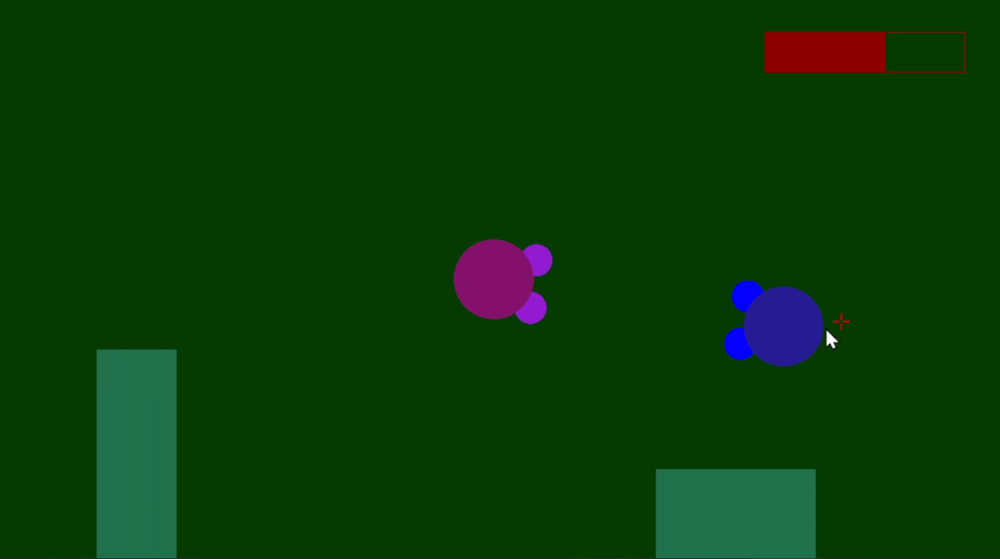

## surviv.io clone ##

Survivio is a project developed for the Computer Graphics subject. The player has to kill the enemies using projectiles and survive as much as possible.

## Preview ##

## Homework reference ##
https://ocw.cs.pub.ro/courses/egc/teme/2021/01

## Tech stack ##
 * C++
 * OpenGL 2D
 * [Computer Graphics UPB Framework](https://github.com/UPB-Graphics/gfx-framework)

## Features ##

 * Projectiles
 * Randomly spawned moving enemies
 * Collisions 
 * Animations and graphic design
 * HP HUD

## Gameplay ##
https://www.youtube.com/watch?v=ewc7NSL5pww
